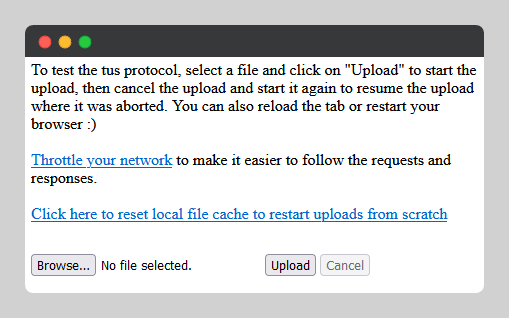
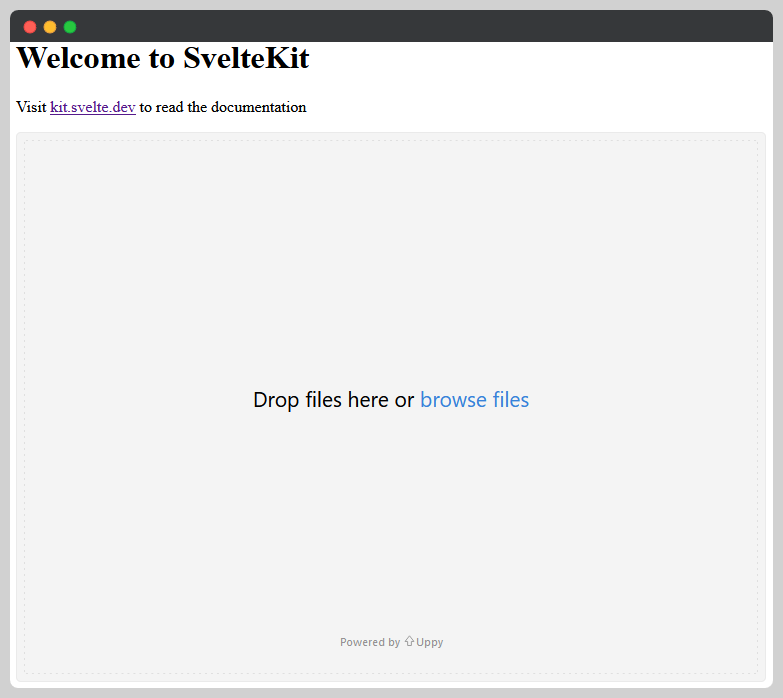

This folder contains examples for different implementations.

### dotnetcore
Uses the basic tus-client along with a dotnet core web api.

### sveltedotnet
Uses the sveltekit framework with svelte and @uppy library (dashboard + tus).

